# Overview

## STP Framework

The STP framework decomposes team decision-making into three layers that separate *what the team does*, *what each robot does*, and *how it does it*. 
 
A behavior tree (BT) serves as the execution engine (`decide` in `strategy_node.py`) that ticks through all three layers 60 times per second. Each tick produces a set of target positions for all robots on the team.

### Architecture

 
### Folder Structure
 
```
strategy/
├── strategy_node.py        # entry point — receives state, ticks BT, publishes targets
├── state.py                # GameState dataclass (built from raw JSON each frame)
├── geometry.py             # spatial queries: clear shot, pass lane, distances
├── prediction.py           # ball trajectory prediction + intercept computation
│
├── plays/                  # team-level: "what formation do we run"
│   ├── playbook.py         # selects active play from game state conditions
│   ├── offensive.py        # 1 attacker + 1 supporter + 1 defender
│   ├── defensive.py        # 2 defenders + 1 pressing attacker
│   └── kickoff.py          # set piece formations
│
├── tactics/                # per-robot: "what should this robot do"
│   ├── role_assignments.py # cost-based auction for attacker/supporter/defender
│   ├── attacker.py         # FSM: approach -> dribble -> shoot/pass
│   ├── supporter.py        # position for pass, create space
│   └── defender.py         # block shot line, cover goal, intercept
│
├── skills/                 # low-level: "how does the robot do it"
│   ├── navigate.py         # go-to-point + intercept (static or moving target)
│   ├── kick.py             # approach from angle + kick toward target
│   └── dribble.py          # ball control while moving (RL-trained later)
│
├── bt/                     # behavior tree engine (py_trees)
│   └── tree.py             # root tree: ticks plays -> tactics -> skills
│
└── rl/                     # reinforcement learning (undecided)
```
 

## JSON Wire Format (from :5555)

What `simulation_node.py` publishes each frame:

```json
{
  "t": 1234567890.123,
  "ball": {
    "x": 4.5, "y": 3.0,
    "vx": 0.2, "vy": -0.1
  },
  "robots": {
    "0": { "x": 2.0, "y": 3.0, "vx": 0.0, "vy": 0.0, "angle": 0.0, "omega": 0.0 },
    "1": { "x": 3.5, "y": 4.0, "vx": 0.0, "vy": 0.0, "angle": 0.0, "omega": 0.0 },
    "2": { "x": 1.0, "y": 3.0, "vx": 0.0, "vy": 0.0, "angle": 0.0, "omega": 0.0 },
    "3": { "x": 7.0, "y": 3.0, "vx": 0.0, "vy": 0.0, "angle": 0.0, "omega": 0.0 },
    "4": { "x": 6.0, "y": 2.0, "vx": 0.0, "vy": 0.0, "angle": 0.0, "omega": 0.0 },
    "5": { "x": 8.0, "y": 3.0, "vx": 0.0, "vy": 0.0, "angle": 0.0, "omega": 0.0 }
  }
}
```

Robots 0-2 = blue team, robots 3-5 = red team.

## Output Format (to :5556)

This is what `strategy_node.py` publishes after each tick:

```json
{
  "targets": {
    "0": { "x": 5.2, "y": 3.1, "mode": "2005_INVERSION" },
    "1": { "x": 6.5, "y": 4.5, "mode": "2005_INVERSION" },
    "2": { "x": 1.5, "y": 3.0, "mode": "2005_INVERSION" }
  }
}
```

Same format as `viz_node.py` manual targets.

## Constants

From `config.py`:

| Constant | Value | Description |
|----------|-------|-------------|
| `FIELD_W` | 9.0 m | Field length |
| `FIELD_H` | 6.0 m | Field width |
| `ROBOT_RADIUS` | ~0.143 m | Robot body radius |
| `BALL_RADIUS` | 0.043 m | Ball radius |
| `DRIBBLE_RANGE` | ~0.05 m | Max distance for has_ball |
| `KICK_RANGE` | ~0.08 m | Max distance to trigger kick |

## Reference
- https://nn.cs.utexas.edu/?AB05
- https://arxiv.org/abs/2310.13396
- https://2019.robocup.org/downloads/program/OcanaEtAl2019.pdf
- https://www.cs.cmu.edu/~mmv/papers/18robocup-SchZhuVel.pdf
- https://arxiv.org/pdf/2203.13083
- https://ieeexplore.ieee.org/document/8594083
